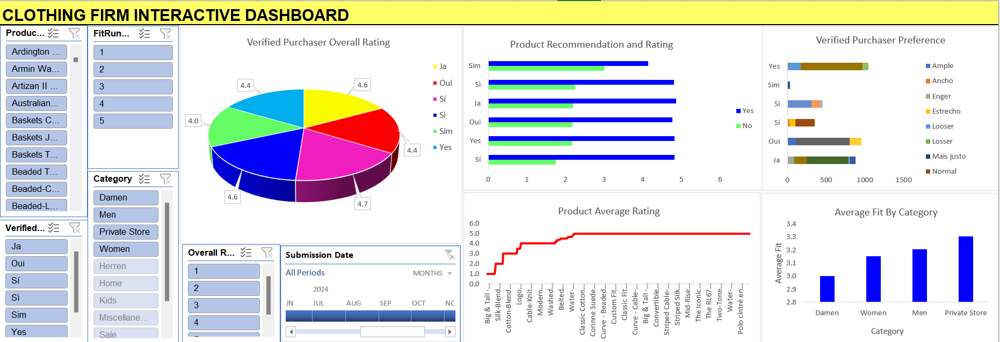
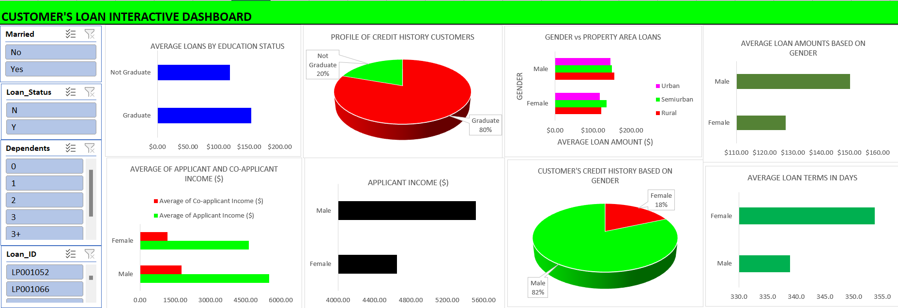
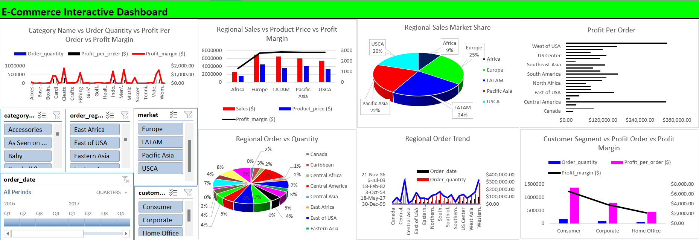
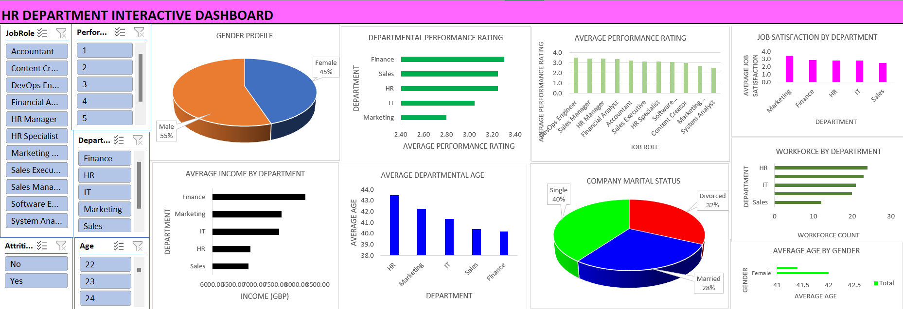
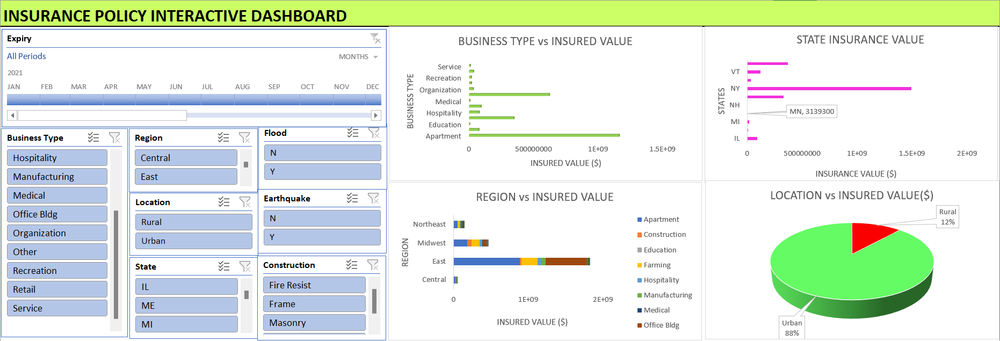
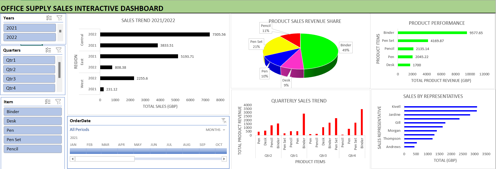
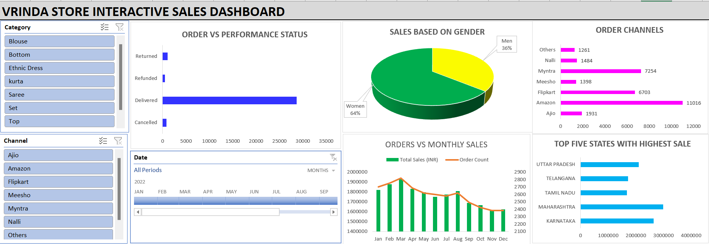
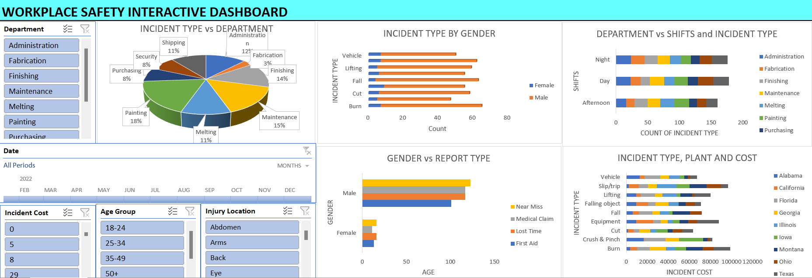

# Project 1

**Title:** [Customer Insights and Product Feedback Analysis for a Clothing Firm](https://github.com/Osiwi/github.io/blob/main/Clothing%20Firm%20Data%20Cleaned.xlsx)

**Tools & Technologies Used:** 
Microsoft Excel: Core platform for building the interactive dashboard.
Dashboard Layout and Interactivity: Structured layout with dynamic visuals and responsive filters.
Slicers and Drop-Down Filters: Enabled real-time data filtering by product, fit rating, category, and timeframe.
Pivot Tables and Pivot Charts: Used for dynamic aggregation and visual representation of data insights.
Conditional Formatting: Applied for visual cues to highlight trends and key metrics.
Power Query (Get & Transform): Utilized for cleaning, reshaping, and importing structured datasets.
Form Controls / Slicers: Added interactivity for end-users to explore multidimensional data.
Data Model (Power Pivot): Integrated to manage relationships between multiple tables and enable advanced DAX calculations.

**Project Description Overview:** Clothing Firm Interactive Dashboard: This project involved analyzing customer review data from a clothing firm to uncover insights into product performance, fit preferences, and customer satisfaction. The dashboard is designed to provide a comprehensive and interactive overview of key customer feedback metrics. It enables stakeholders to easily monitor and evaluate how different products are perceived across various customer segments and time periods.

**Objective:** To equip stakeholders with actionable insights into how verified purchasers rate and recommend clothing products, with the goal of improving product design, marketing strategies, and inventory planning.

**Key Features Included in the Dashboard:** 
Verified Purchaser Overall Rating
A pie chart showing average product ratings across different verification languages (e.g., Ja, Oui, Sí), offering a high-level view of customer sentiment.
Product Recommendation and Rating
Horizontal bar charts indicating the number of recommendations ("Yes"/"No") alongside average ratings for various customer groups.
Verified Purchaser Preference
Visual breakdown of customer fit perceptions (e.g., Ample, Normal, Looser) segmented by verification group.
Product Average Rating
Line chart showcasing how individual clothing products are rated, helping identify bestsellers and products needing improvement.
Average Fit by Category
Bar chart showing how fit ratings differ across categories such as Women, Men, Damen, and Private Store.

**Interactive Slicers and Filters**
The dashboard includes dynamic slicers and filters for user-driven exploration:
Product: Focus on specific products for detailed performance analysis.
Fit Rating: Explore data based on how well customers think the products fit.
Verified Language: View feedback from customers using different language options (Yes, Ja, Oui, etc.).
Category: Analyze performance across gender and store-specific categories.
Overall Rating: Filter by specific star ratings to study high or low-rated feedback.
Submission Date: Analyze trends over specific months using the interactive timeline.
 
**Key findings:**
The goal was to surface patterns and insights that inform strategic decisions in product design, marketing, and supply chain management. The key findings from the analysis are stated below:
1. Consistently High Customer Satisfaction:
The overall rating from verified purchasers across different languages (Yes, Ja, Oui, etc.) ranged between 4.0 and 4.7, indicating generally high satisfaction levels.
The highest average rating (4.7) was observed from "Sí" users, while the lowest (4.0) came from "Sim" users.
2. Strong Product Recommendations:
Customers were overwhelmingly likely to recommend products, with the "Yes" responses significantly outpacing the "No" responses in all categories.
Average product ratings where customers answered “Yes” were consistently near 4.5–5.0, reinforcing product quality perception.
3. Fit Perception Varies by User Segment:
Preferences like "Normal", "Ample", and "Looser" dominated fit feedback.
"Mais justo" (more fitted) and "Ancho" (wide) also appeared notably across some segments.
Insights suggest the need to regionalize or personalize fit specifications based on customer feedback clusters.
4. Top-Performing Products Identified:
Products such as “Classic Cotton,” “Curve Suede,” and “Corinne Suede” received perfect 5.0 ratings, signaling strong customer approval.
Lower-rated products can be reviewed for potential improvements in quality or sizing accuracy.
5. Category-Specific Fit Insights:
The “Private Store” category recorded the highest average fit rating (~3.3), suggesting better sizing satisfaction in this group.
“Damen” category showed the lowest average fit rating (~2.9), highlighting an area for product refinement.
6. Review Activity Over Time:
The time slicer shows submission activity across June to October 2024, enabling seasonal trend analysis and campaign performance tracking.
Summary:
This dashboard empowered stakeholders to interactively explore insights across dimensions such as product, region, fit preference, and time, offering an efficient decision-support system. It bridges the gap between raw customer feedback and actionable business intelligence.

**Dashboard Overview:** 

# Project 2

**Title:** [Customers Loan Insights](https://github.com/Osiwi/github.io/blob/main/Loan_Sanction_Cleaned.xlsx)

**Tools & Technologies Used:** 
Microsoft Excel: Primary platform for data analysis and dashboard development.
Pivot Tables & Pivot Charts: Used to dynamically summarize income, loan status, credit history, and demographic data.
Slicers & Filters: Enable user interactivity by filtering based on gender, marital status, dependents, loan status, and loan ID.
Conditional Formatting: Highlights key values such as loan amounts and incomes.
Form Controls: Provides a user-friendly interface for data segmentation.
Power Query (Get & Transform): Used for cleaning and preparing raw loan data before analysis.
Chart Types: Includes pie charts, bar charts, and clustered columns for visual insights.

**Project Description Overview:**
Customers Loan Interactive Dashboard: This interactive dashboard was created to analyze loan application data and uncover key insights related to customer profiles, income levels, loan status, and approval trends. Designed for financial institutions and stakeholders, the dashboard provides a user-friendly visual summary of applicant behavior, gender-based patterns, and education-level influences on loan approval and terms.

**Objective:**
To provide a data-driven overview of loan applicants by visualizing income levels, education status, gender influence, property area distribution, credit history, and loan decisions, enabling stakeholders to identify approval trends and risk indicators.

**Key Features Included in the Dashboard:**
Average Loans by Education Status: Bar chart comparing loan amounts between graduates and non-graduates.
Credit History Profile: Pie chart showing the ratio of graduates in the customer base with credit history.
Gender vs Property Area: Horizontal bar chart showing how gender and area (urban, rural, semiurban) relate to average loan amounts.
Average Loan Amounts by Gender: Male applicants request higher average loans than female applicants.
Applicant & Co-applicant Income Analysis: Income distribution by gender, comparing applicant vs. co-applicant.
Customer Credit History by Gender: 82% of applicants with credit history are male.
Loan Term Duration by Gender: Females have slightly longer average loan terms in days.

**Key findings:**
Graduates dominate the credit history group (80%), suggesting a strong correlation between education and credit access.
Male applicants make up 82% of those with a credit history, indicating possible gender-based approval biases or trends.
Male applicants tend to have higher average loan amounts and incomes, suggesting stronger loan eligibility or confidence in applying.
Semiurban areas show slightly higher average loan values, especially among male applicants.
Females have slightly longer loan terms, which may imply different repayment strategies or loan structuring.

**Dashboard Overview:** 

# Project 3

**Title:** [E-Commerce Performance Insights](https://github.com/Osiwi/github.io/blob/main/ecommerce_cleaned_final.xlsx)

**Tools & Technologies Used:** 
Microsoft Excel: Primary platform for dashboard creation and analysis.
Pivot Tables & Pivot Charts: Used for aggregating data by region, product category, segment, and time.
Slicers & Timeline Filters: Enabled user interaction across categories like region, market, date, and customer segment.
Power Query (Get & Transform): For cleaning, merging, and reshaping datasets before visualization.
Combo Charts & Pie Charts: Visualized multiple metrics such as order quantity, profit margin, and profit per order simultaneously.
Conditional Formatting: Used to emphasize performance variations across metrics like margin and order count.

**Project Description Overview:**
This interactive Excel dashboard was developed to provide a comprehensive overview of e-commerce performance across global regions, product categories, and customer segments. It offers insights into order quantity, profitability, sales distribution, and market share—empowering stakeholders to make strategic data-driven decisions in product planning, regional marketing, and revenue optimization.

**Objective:**
To analyze and visualize multi-dimensional e-commerce data—enabling business leaders to track performance trends, identify top-performing regions and categories, and optimize profit margins across different markets and customer segments.

**Key Features Included in the Dashboard:**
Category-wise Performance Metrics: Combines order quantity, profit per order, and profit margin for each product category in a multi-axis chart.
Regional Sales vs Price vs Margin: Compares sales revenue, product pricing, and profit margin across major regions like Africa, Europe, and USCA.
Market Share Visualization: Pie chart showing regional contribution to total sales.
Profit Per Order by Region: Bar chart analyzing profitability by geographic location.
Regional Order Distribution: Pie chart detailing the percentage contribution of each region to total order quantity.
Time-based Order Trends: Line chart tracking historical order quantity by region over multiple years.
Customer Segment Profit Analysis: Combines quantity, per-order profit, and margin across Consumer, Corporate, and Home Office segments.

**Key findings:**
Europe and LATAM (Latin America) dominate regional market share, contributing a combined 49% of total sales.
Consumer segment leads in profit per order, while Corporate has the highest order volume.
Pacific Asia and USCA maintain the best balance between sales volume and profit margin.
Central America has the highest average profit per order, despite a smaller order quantity—indicating high-margin products.
Order quantities spike in several categories like Women’s, Fishing, and Boxing, showing demand concentration.
Customer segment profitability shows diminishing margins from Consumer to Home Office, signaling a need to reassess pricing or marketing strategies.
Summary:
This e-commerce dashboard brings together complex sales and profitability data into an intuitive, visually compelling format. With strong use of slicers and comparative charts, it serves as a powerful tool for business intelligence teams and decision-makers to optimize performance by geography, product, and customer type.

**Dashboard Overview:** 

# Project 4

**Title:** [HR Department Employee Insights](https://github.com/Osiwi/github.io/blob/main/HR_Employee_Data%20Cleaned.xlsx)

**Tools & Technologies Used:** 
Microsoft Excel: Primary platform for dashboard development and data visualization.
Pivot Tables & Pivot Charts: Used to summarize and analyze metrics by department, job role, and demographic attributes.
Slicers & Filters: Enabled dynamic filtering by job role, department, age, attrition status, and performance rating.
Combo Charts & Pie Charts: Used to display categorical distributions and comparisons (e.g., gender profile, marital status).
Power Query (Get & Transform): Used to clean HR data before analysis.
Conditional Formatting: Applied to enhance data readability and highlight critical HR metrics.

**Project Description Overview:**
This interactive HR dashboard provides a comprehensive overview of employee performance, satisfaction, demographics, and departmental insights. Built in Excel, it supports HR managers and business leaders in making data-informed decisions about workforce planning, employee engagement, and organizational structure.

**Objective:**
To visualize and analyze HR data in an interactive format that reveals trends in performance ratings, job satisfaction, department-level workforce distribution, income, age demographics, and attrition risks—empowering the HR department to drive better people-management strategies.

**Key Features Included in the Dashboard:**
Gender Profile Distribution: Pie chart displaying the male-to-female workforce ratio (55% male, 45% female).
Departmental Performance Rating: Horizontal bar chart comparing performance across departments like HR, IT, Sales, and Finance.
Job Satisfaction by Department: Visual insight into which departments report higher or lower satisfaction levels.
Workforce Count by Department: Highlights employee distribution across departments.
Average Income by Department: Income analysis segmented by department, with Finance leading in compensation.
Average Performance by Job Role: Comparison of performance across roles such as DevOps, HR Manager, and Analyst.
Marital Status Profile: Breakdown of employees into Single (40%), Married (28%), and Divorced (32%).
Average Age by Gender and Department: Age analysis by department and gender to aid generational workforce planning.

**Key findings:**
Finance department leads in average performance and income, indicating a highly productive and well-compensated team.
Marketing has the lowest performance rating, suggesting potential training or restructuring needs.
HR has the highest average departmental age (~43.7 years), which may have implications for succession planning.
Single employees form the largest portion of the workforce (40%), which may influence benefit and engagement strategies.
Female employees are slightly younger on average than males, a useful metric for long-term workforce diversity planning.
IT and HR departments have the largest workforces, which may reflect organizational priorities or operational demands.
Summary:
This HR dashboard transforms employee data into a visually engaging, actionable tool that supports data-driven decision-making in people management. It provides insights across demographics, performance, and department-level trends; helping HR leaders proactively manage workforce development and employee well-being.

**Dashboard Overview:** 

# Project 5

**Title:** [Insurance Policy Insights](https://github.com/Osiwi/github.io/blob/main/Insurance%20Policies%20Data%20Cleaned.xlsx)

**Tools & Technologies Used:** 
Microsoft Excel: Main platform used for dashboard development.
Pivot Tables & Pivot Charts: Used to summarize insured values across business types, locations, and hazards.
Slicers & Timeline Filters: Allow users to filter by business type, region, state, flood, earthquake, construction type, and date.
Combo and Pie Charts: Provide comparative and categorical views of insured values.
Power Query (Get & Transform): Used for cleaning and transforming the raw insurance data.
Conditional Formatting: Applied to emphasize high-risk areas and high-value regions.

**Project Description Overview:**
This Excel-based interactive dashboard was designed to provide a comprehensive view of insurance policy distributions and insured values across different business types, geographic regions, and risk categories. It offers stakeholders a dynamic way to explore insured property values and assess risk exposure based on factors like location, flood/earthquake vulnerability, and construction type.

**Objective:**
To analyze and visualize insured property values and policy trends across business sectors and geographical zones, helping insurance analysts and underwriters identify risk concentrations, high-value policies, and areas of potential exposure.

**Key Features Included in the Dashboard:**
Business Type vs Insured Value: Horizontal bar chart showing how various sectors (e.g., Medical, Hospitality, Service) compare in insured value.
State Insurance Value: Bar chart visualizing insured value contributions by state, with NY leading.
Region vs Insured Value: Stacked bar chart comparing insured values by region and property type.
Location vs Insured Value: Pie chart showing urban vs rural value distribution (Urban = 88%, Rural = 12%).
Construction Type, Earthquake, Flood Filters: Allow interactive analysis based on property risk profiles.
Expiry Date Timeline: Provides filtering by month or period to view policy distribution over time.

**Key findings:**
Urban areas account for 88% of the total insured value, indicating concentrated policy value in metropolitan zones.
New York has the highest insured value by state, followed by other northeastern states.
Apartments and Hospitality businesses lead in insured value, with some exceeding $1.5 billion.
The East region dominates in total insured value, particularly in the medical and office building categories.
Flood and Earthquake-prone properties can be filtered for more focused risk exposure analysis.
Summary:
This Insurance Policy Dashboard effectively transforms raw insurance policy data into an interactive tool that supports risk assessment and portfolio analysis. By segmenting data across regions, industries, and risk types, the dashboard empowers insurers and analysts to make informed decisions on underwriting, pricing, and risk management.

**Dashboard Overview:** 

# Project 6

**Title:** [Office Supply Sales Insight](https://github.com/Osiwi/github.io/blob/main/Office%20supply%20sales%20Data%20Cleaned.xlsx)

**Tools & Technologies Used:** 
Microsoft Excel: Core tool for data modeling and dashboard creation.
Pivot Tables & Pivot Charts: Used to calculate and visualize total revenue, item sales, and sales trends across time and regions.
Slicers & Timeline Filters: Enabled filtering by year, quarter, item, and order date for dynamic data exploration.
Power Query (Get & Transform): Used to clean and load raw sales data for reporting.
Combo, Bar, and Pie Charts: Provided intuitive visual comparisons of sales reps, product performance, and revenue distribution.
Conditional Formatting: Highlighted top-performing items and regions.

**Project Description Overview:**
This Excel-based interactive dashboard presents a comprehensive analysis of office supply sales performance across multiple regions, quarters, products, and sales representatives. It allows stakeholders to track product-level performance, assess quarterly and regional sales trends, and identify top-performing sales reps and revenue drivers.

**Objective:**
To visualize office supply sales data to reveal performance patterns by item, quarter, region, and sales representative—enabling sales managers to make informed decisions about resource allocation, marketing strategies, and inventory planning.

**Key Features Included in the Dashboard:**
Sales Trend by Region: Bar chart comparing yearly performance across Central, East, and West regions.
Product Sales Revenue Share: Pie chart showing revenue contribution by item (e.g., Binder, Pen Set, Pencil).
Product Performance: Horizontal bar chart ranking products by total revenue (GBP).
Quarterly Sales Trend: Bar chart illustrating item-wise revenue changes across quarters.
Sales by Representatives: Bar chart showing total revenue generated by each sales rep, highlighting top performers.
Interactive Filtering: Dynamic filters for year, quarter, item, and order date for focused analysis.

**Key findings:**
Binders dominate sales performance, accounting for 49% of total revenue and generating over £9,500.
Pen Sets rank second, contributing 21% of revenue, followed by Pencils and Pens.
The Central region in 2022 led all sales with over £7,300, showing a strong upward trend.
Sales peaked in Q4, especially for Binders, indicating seasonal demand or year-end procurement patterns.
Kivell and Jardine were the top-performing sales reps, collectively generating more than £6,000 in sales.
Desks and Pens underperformed relative to other products, suggesting opportunities for promotional focus or inventory review.
Summary:
This dashboard transforms raw sales data into a highly visual, interactive report that allows stakeholders to explore trends by product, region, time, and salesperson. It serves as a valuable decision-support tool for monitoring performance, optimizing sales strategies, and improving future forecasting accuracy.

**Dashboard Overview:** 

# Project 7

**Title:** [Vrinda Store Insight](https://github.com/Osiwi/github.io/blob/main/Vrinda%20Interactive%20Dashboard_Cleaned.xlsx)

**Tools & Technologies Used:** 
Microsoft Excel: Primary tool for creating the interactive sales dashboard.
Pivot Tables & Pivot Charts: Used to summarize performance metrics such as sales by state, category, channel, and gender.
Slicers & Timeline Filters: Enabled dynamic filtering by category, channel, and order dates for detailed data exploration.
Combo Charts & Pie Charts: Visualized categorical insights (e.g., gender-based sales, order statuses, top-performing states).
Power Query (Get & Transform): Used for cleaning and shaping raw order and sales data.
Bar Charts & Trend Lines: Provided comparative analysis for order channels, performance status, and monthly sales activity.

**Project Description Overview:**
This interactive Excel dashboard provides a comprehensive view of Vrinda Store’s sales performance, customer trends, and fulfillment efficiency. By integrating sales data from multiple e-commerce platforms and filtering by category, geography, and customer demographics, the dashboard empowers business managers to monitor order trends, optimize channels, and identify revenue growth opportunities.

**Objective:**
To track and analyze e-commerce sales performance across order statuses, product categories, customer gender, sales channels, and geographic regions—enabling informed strategic decisions for online retail optimization.

**Key Features Included in the Dashboard:**
Order vs Performance Status: Visual breakdown of order outcomes (Delivered, Returned, Refunded, Cancelled), highlighting operational efficiency.
Sales Based on Gender: Pie chart showing gender-wise contribution to total sales, with women accounting for the majority.
Order Channels: Bar chart comparison of sales volume across platforms like Amazon, Flipkart, Myntra, Meesho, and others.
Orders vs Monthly Sales: Combo chart revealing monthly sales values (INR) and corresponding order volume trends.
Top Five States by Sales: Bar chart showing the leading states in terms of sales revenue.
Interactive Filters: Slicers for category, sales channel, and time period enable targeted analysis.

**Key findings:**
64% of total sales were generated by women, indicating a strong female customer base.
Amazon is the top-performing sales channel, followed closely by Myntra and Flipkart.
Delivered orders account for the vast majority, reflecting effective fulfillment operations.
Sales peaked in Q1 and Q2 (January–June), with noticeable seasonal dips later in the year.
Karnataka and Maharashtra lead in state-wise sales, together accounting for a significant portion of total revenue.
Sarees, Kurtas, and Ethnic Dresses are likely top-performing categories, though filter analysis is required for validation.
Summary:
The Vrinda Store dashboard offers actionable insights into customer preferences, fulfillment status, and multi-channel e-commerce performance. Built entirely in Excel, this tool empowers retail decision-makers with real-time, interactive access to their key business drivers—supporting improved marketing, logistics, and product focus strategies.

**Dashboard Overview:** 

# Project 8

**Title:** [Workplace Safety Insight](https://github.com/Osiwi/github.io/blob/main/Workplace%20Safety%20Data%20Cleaned.xlsx)

**Tools & Technologies Used:** 
Microsoft Excel: Main platform for data visualization and interactive dashboard design.
Pivot Tables & Charts: Used for dynamic summaries of incident types, departments, shifts, genders, and costs.
Slicers & Timeline Filters: Enabled user-driven filtering by department, age group, injury location, incident cost, and date.
Pie, Bar & Stacked Charts: Provided clear comparative visuals across gender, location, and shifts.
Combo Charts: Used for multi-dimensional views like plant vs incident type vs cost.
Power Query (Get & Transform): Used to clean and integrate raw safety incident data for analysis.

**Project Description Overview:**
This Excel-based interactive dashboard tracks and visualizes workplace safety incidents across various departments, locations, and demographics. It supports safety managers and HR teams by uncovering trends in incident frequency, injury types, cost impact, and departmental exposure; providing insights to improve workplace safety strategies and reduce operational risks.

**Objective:**
To monitor, analyze, and report workplace safety incidents by type, shift, department, gender, location, and cost—enabling better safety compliance, risk mitigation, and employee health strategies.

**Key Features Included in the Dashboard:**
Incident Type vs Department: Pie chart categorizing incidents across operational units like Maintenance, Painting, and Finishing.
Incident Type by Gender: Side-by-side bar chart comparing incident frequency between male and female workers.
Department vs Shifts and Incident Type: Multi-level analysis of when and where incidents occur most frequently.
Gender vs Report Type: Breakdown of report classifications (e.g., Near Miss, Lost Time, Medical Claim) by gender.
Incident Type, Plant and Cost: Multi-category analysis linking incident types to geographic locations and their associated financial costs.
Interactive Filters: Filter by date, department, age group, injury location, and cost levels for focused insights.

**Key findings:**
Painting and Maintenance departments had the highest number of incidents, with Painting alone contributing 18%.
Burns and Cuts were the most frequent injury types, predominantly affecting male workers.
Incidents occurred most often during the Night and Day shifts, especially in high-risk departments like Fabrication and Melting.
Male employees experienced a higher rate of serious reports, including Lost Time and Medical Claims.
Slip/Trip and Burn incidents were the costliest, with certain plants like Texas and California showing high-cost concentration.
Workers aged 25–34 and 35–49 represented the most affected age groups, highlighting a critical target for safety interventions.
Summary:
This Workplace Safety Dashboard provides an actionable view of incident trends across locations, departments, and demographics. It empowers safety officers and managers with the insights needed to reduce injury rates, target safety training, and prioritize high-cost risk areas—ultimately contributing to a safer and more compliant workplace.

**Dashboard Overview:** 

# Project 9

**Title:**
Employee Data Interogation and Manipulation

**SQL Code:**
[Employee SQL code](https://github.com/Osiwi/github.io/blob/main/Employee.SQL)

**SQL Skills Used:**
Data Retrieval (SELECT): Queried and extracted specific information from the database.
Data Aggregation (SUM, COUNT): Calculated totals, such as sales and quantities, and counted records to analyze data trends.
Data Filtering (WHERE, BETWEEN, IN, AND): Applied filters to select relevant data, including filtering by ranges and lists.
Data Source Specification (FROM): Specified the tables used as data sources for retrieval
 
**Project Description:**
This project focuses on the analysis of a comprehensive dataset containing detailed information about approximately 11,000 football players. The primary objective is to utilize SQL for extracting meaningful insights regarding player demographics, performance metrics, and other relevant attributes.
Database Design and Implementation: Develop a relational database schema to effectively store and manage the football players' data, ensuring normalization and referential integrity.
Data Analysis Using SQL: Execute SQL queries to analyze various aspects of the dataset, including: Player demographics (e.g., age, nationality). Performance metrics (e.g., ratings, positions). Financial attributes (e.g., wages, market value).
Insight Extraction: Identify patterns and trends within the data, such as: Nationalities with the highest representation among players. Correlation between player attributes and performance metrics. Distribution of players across different clubs and leagues.
Reporting and Visualization: Present the findings through comprehensive reports and visualizations to facilitate better understanding and decision-making. By the end of this project, we aim to have a fully functional SQL database capable of providing in-depth analysis of football players' data, offering valuable insights for stakeholders such as team managers, scouts, and analysts

**Technology used:** 
SQL server
